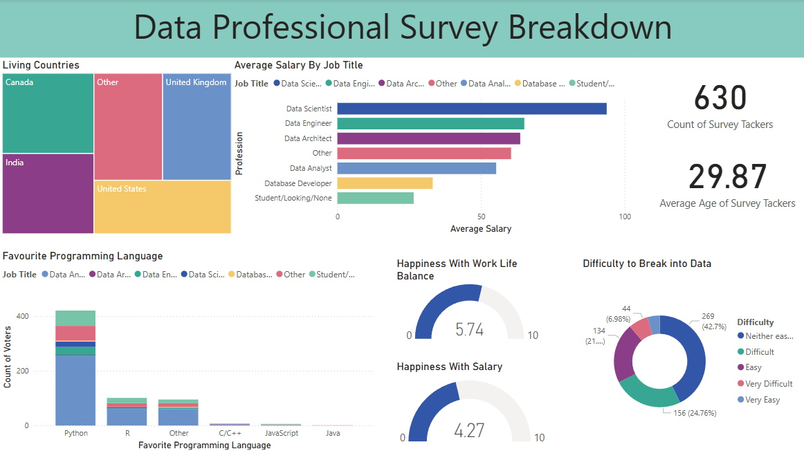

# Data Professional Survey Dashboard

## Overview
This project is an interactive **Power BI Dashboard** that visualizes insights from a professional survey dataset. The dashboard provides an overview of survey respondents, their job titles, salaries, favorite programming languages, and work-life balance satisfaction.

## Features
- **Demographic Analysis**: Breakdown of survey participants by country.  
- **Salary Insights**: Average salary visualization by job title.  
- **Programming Language Preference**: Popular programming languages among data professionals.  
- **Work-Life Balance & Salary Satisfaction**: Gauges displaying happiness scores.  
- **Entry Difficulty**: Pie chart showing how difficult respondents found breaking into the data industry.  

## Dashboard Preview  
  

## How to Use  
1. Open the Power BI file (`.pbix`).  
2. Load the dataset if needed.  
3. Interact with visualizations using filters and slicers.  

## Tools Used  
- **Power BI** for dashboard creation  
- **DAX & Power Query** for data transformation  
- **Survey Dataset** for insights  

## Contributing  
Feel free to fork the repository, make improvements, and submit pull requests.  

## License  
This project is licensed under the MIT License.  
